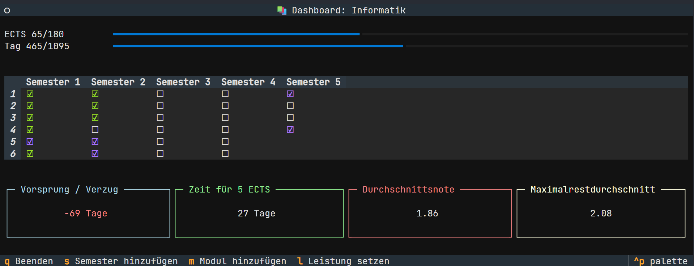
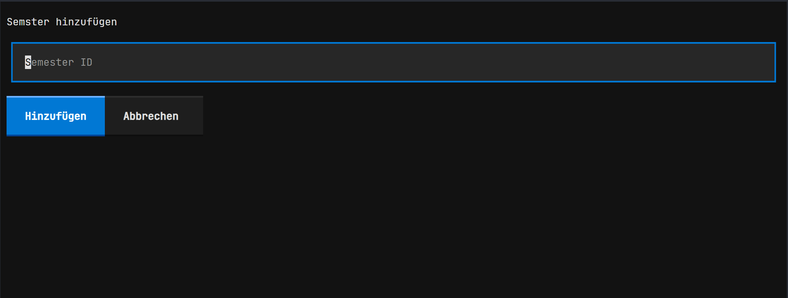
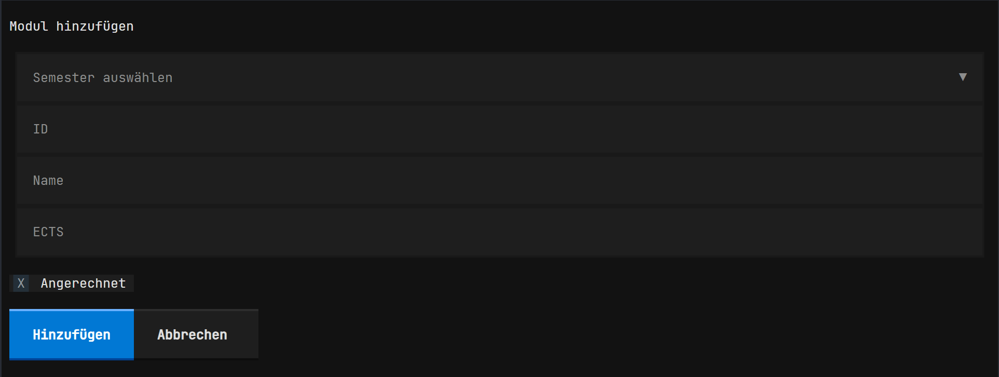
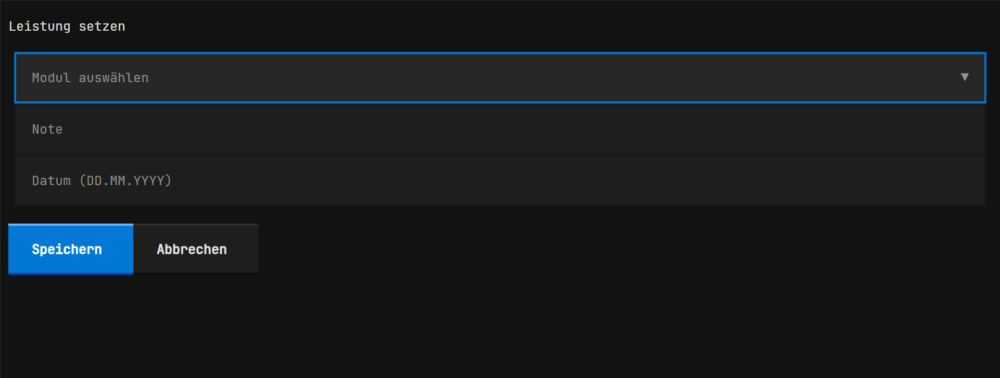

# Study Progress Dashboard

Eine Python-Anwendung für die Verwaltung und Verfolgung des Studienfortschritts.

## Screenshots

### Hauptseite

### Semester hinzufügen

### Modul hinzufügen

### Leistung setzen

